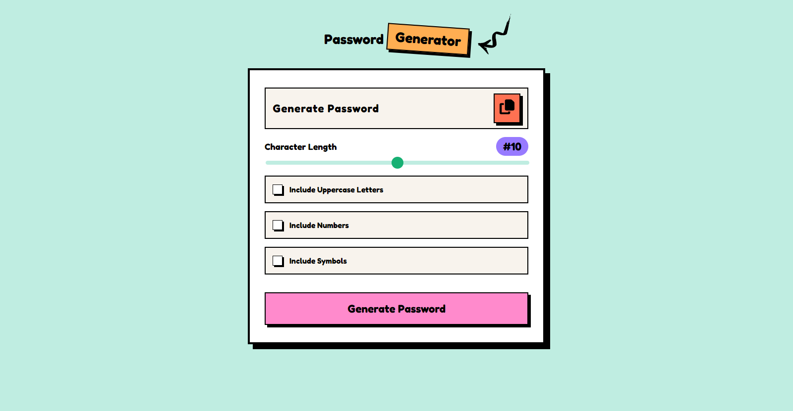
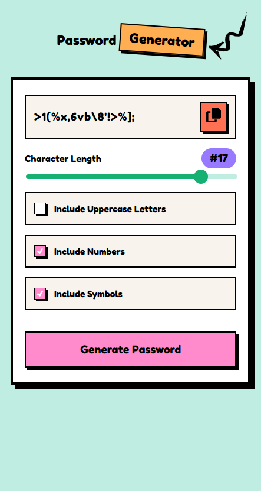
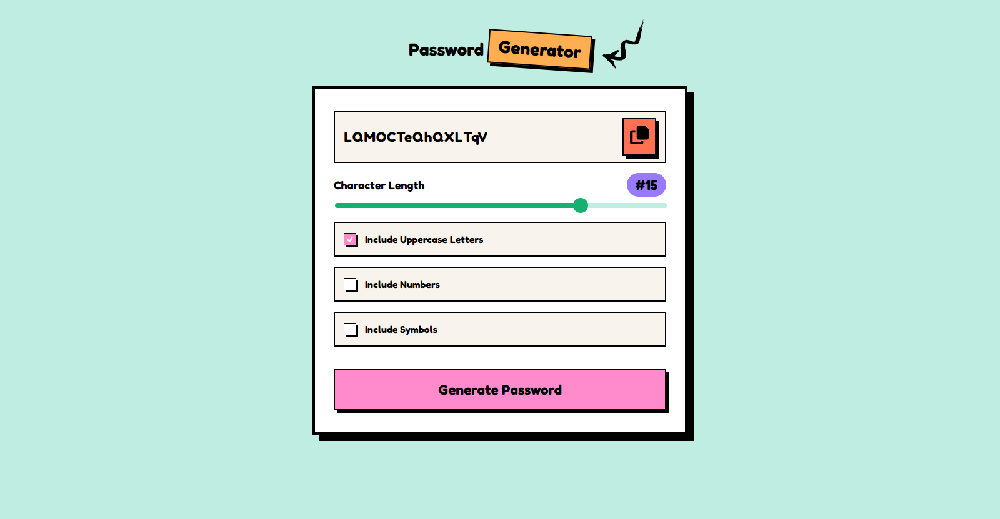
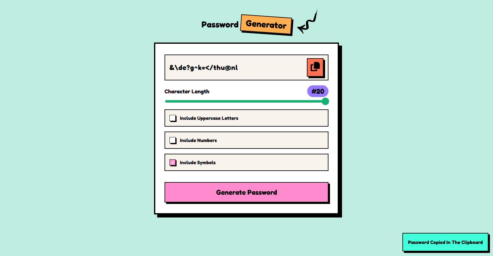
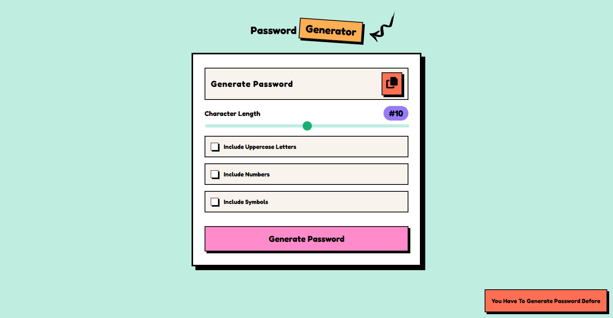

# Vue.js Password Generator



## Welcome! 👋

A simple password generator project for creating strong and secure passwords, built with Vue.js and bundled with Vite.js. This password generator is designed to help you generate random and complex passwords that are difficult for hackers to crack. You can customize the password length and include various character types to suit your specific needs.

## Table of Contents

- [Features](#features)
- [Getting Started](#getting-started)
- [Usage](#usage)
- [Customization](#customization)
- [Screenshot](#screenshot)
- [Contributing](#contributing)
- [Links](#links)
- [Author](#author)

## Features

- Generate random and secure passwords.
- Customize password length and character types.
- Easily copy generated passwords to the clipboard.
- Intuitive and user-friendly Vue.js interface.
- Bundled with Vite.js for fast development and building.

## Getting Started

To get started with this password generator, follow these steps:

1. Install the project dependencies:

   ```bash
   yarn install
   ```

2. Run the development server:

   ```bash
   yarn dev
   ```

3. Run for the production:

   ```bash
   yarn build
   ```

4. Open your web browser and access the application at `http://localhost:3000`. Or change the setting in Vite Js Config Files.

## Usage

1. Open the Vue.js password generator in your web browser.
2. Customize your password preferences:
   - Choose the desired password length.
   - Select the character types you want to include (e.g., uppercase letters, numbers, and special characters "Symbols").
3. Click the "Generate Password" button to generate a password that meets your criteria.
4. Click the "Copy to Clipboard" button to copy the generated password to your clipboard.
5. Use the generated password for your online accounts and make sure to store it securely.

## Screenshot

### Mobile



### Desktop



### Clipboard Copy



### Clipboard Copy Errors



## Customization

You can easily customize the password generation process by modifying the Vue.js components and code in this project. The key configuration files to look into are:

- `src/components/PasswordGenerator.vue`: Customize the layout and behavior of the password generator options.

## Contributing

If you'd like to contribute to this Vue.js project, please follow these guidelines:

1. Fork the repository.
2. Create a new branch for your feature or bug fix:

   ```bash
   git checkout -b feature/your-feature-name
   ```

3. Make your changes and commit them with descriptive commit messages.
4. Push your branch to your forked repository:

   ```bash
   git push origin feature/your-feature-name
   ```

5. Create a pull request to the main repository.

## Links

- Live Site URL Here: [Password Generator](https://your-live-site-url.com)

## Author

- GitHub - [Souleymane Sy](https://github.com/SouleymaneSy7)
- Frontend Mentor - [@SouleymaneSy7](https://www.frontendmentor.io/profile/SouleymaneSy7)
- Twitter - [@Souleymanesy43](https://twitter.com/Souleymanesy43)

---

Happy password generating with Vue.js and Vite.js! If you have any questions or encounter any issues, please don't hesitate to [open an issue](https://github.com/SouleymaneSy7/password-generator/issues).
